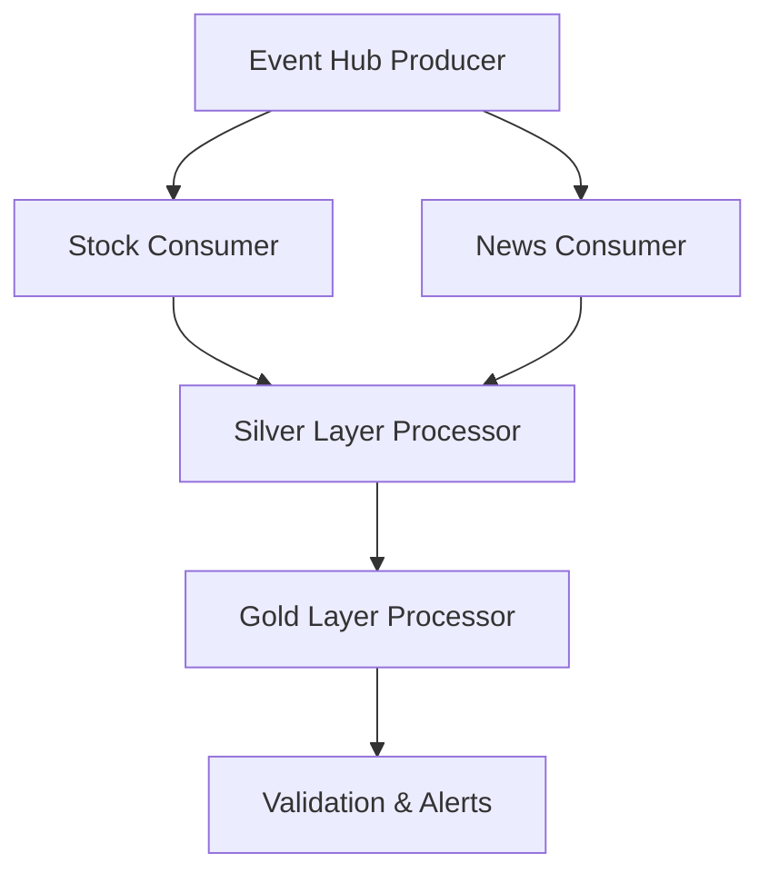

# Real Time Stock Prices and News Sentiment Correlation

## Project Overview
This project implements a real-time and historical (batch) data pipeline to ingest, process, and correlate stock prices with news sentiment using Apache Airflow and Databricks on Azure. The goal is to provide actionable business insights by analyzing the relationship between market movements and news sentiment in both real-time and historical contexts.

## Architecture



- **Event Hub Producer:** Streams real-time stock and news data to Azure Event Hub.
- **Stock Consumer:** Consumes and processes stock data.
- **News Consumer:** Consumes news data and performs sentiment analysis (e.g., with FinBERT).
- **Silver Layer Processor:** Enhances data with analytics and technical indicators.
- **Gold Layer Processor:** Produces business insights and correlations.
- **Validation:** Checks pipeline health and sends alerts.

## DAGs

### 1. `realtime_dag.py`
- **Purpose:** Orchestrates the real-time pipeline for stock and news sentiment analysis, running every 15 minutes during US market hours.
- **Key Tasks:**
  - `check_market_hours`: Branches the DAG depending on whether the market is open.
  - `event_hub_producer`: Submits a Databricks job to fetch and stream data.
  - `stock_consumer`: Processes stock data from Event Hub.
  - `news_consumer`: Processes news data and runs sentiment analysis.
  - `silver_layer_processing`: Enhances data with analytics.
  - `gold_layer_processing`: Generates business insights.
  - `validate_realtime_pipeline`: Validates results and sends alerts if needed.
  - `end_pipeline`: Finalizes the DAG run.
- **Schedule:** Every 15 minutes, 9:00 AM–4:00 PM ET, Monday–Friday.
- **Cluster Configuration:**
  - `event_hub_producer`: Launches a new Databricks cluster (configurable for node type and workers).
  - Other tasks: Use an existing Databricks cluster (ID from Airflow Variable).

### 2. Historical/Batch Processing (`historical_dag.py`, `backfill_dag.py`)
- **Purpose:** Orchestrate batch or backfill processing of historical stock and news data. This is useful for:
  - Backfilling missing data
  - Running analytics on past periods
  - Reprocessing data with updated logic or models
- **Workflow:**
  - Similar to the real-time pipeline, but typically runs over a specified historical date range or for specific backfill intervals.
  - May use different scheduling (e.g., manual trigger, daily, or for a specific date range).
  - Tasks include fetching historical data, processing it through the same or similar consumers and processors, and storing results for analysis.
- **How to Trigger:**
  - Trigger the DAG manually from the Airflow UI, or schedule as needed.
  - Configure date ranges or parameters as required (see DAG code for details).
- **Key Differences from Real-Time Pipeline:**
  - Not limited to market hours; can process any historical period.
  - May process larger data volumes in batch mode.
  - Useful for data recovery, analytics, or model retraining.

## Scripts (in `scripts/`)

- **`01_Event_Hub_Producer.ipynb`**: Fetches real-time or historical stock and news data, streams to Azure Event Hub.
- **`02_Event_Hub_Stock_Consumer.ipynb`**: Consumes stock data from Event Hub, performs initial processing.
- **`02_Event_Hub_News_Consumer.ipynb`**: Consumes news data, performs sentiment analysis (e.g., FinBERT).
- **`02_Silver_Layer_Processor.ipynb`**: Enhances data with analytics, technical indicators.
- **`03_Gold_Layer_Processing.ipynb`**: Generates business insights, correlations between stock prices and sentiment.

## Setup Instructions

### Prerequisites
- Azure subscription with Databricks and Event Hub.
- Sufficient Azure quota for Databricks clusters.
- Airflow environment (with required providers installed).
- API keys for stock and news data sources.

### Installation & Configuration
1. **Clone the repository:**
   ```bash
   git clone <repo-url>
   cd DE-SB-Capstone2
   ```
2. **Install Python dependencies:**
   ```bash
   pip install -r requirements.txt
   ```
3. **Configure Airflow Variables:**
   - `databricks_cluster_id`: ID of the existing Databricks cluster for consumers/processors.
4. **Set up Databricks Connection in Airflow:**
   - Connection ID: `databricks_default`
   - Host, token, etc.
5. **Adjust Cluster Configuration:**
   - In `dags/realtime_dag.py`, set `node_type_id` and `num_workers` to fit your Azure quota.
6. **Deploy DAGs:**
   - Place DAG files in the `dags/` directory.
7. **Deploy Notebooks:**
   - Upload notebooks to Databricks workspace at the specified paths.

## Operational Notes
- The real-time DAG will trigger every 15 minutes during market hours.
- Historical/batch DAGs can be triggered manually or scheduled as needed for backfill or analytics.
- Monitor Airflow UI for DAG/task status.
- Check Databricks for job logs and outputs.
- Ensure API keys and connection strings are securely managed (not hardcoded).

## Troubleshooting
- **Quota Errors:** Lower cluster size or request quota increase in Azure.
- **Task Failures:** Check Airflow logs for error details. Check Databricks job output for notebook errors.
- **Data Issues:** Review validation logs in Airflow. Ensure Event Hub and API credentials are valid.

## Example Airflow Variable Setup
In Airflow UI → Admin → Variables:

| Key                   | Value             |
|-----------------------|-------------------|
| databricks_cluster_id | <your-cluster-id> |

## Example requirements.txt
```
apache-airflow==2.8.1
apache-airflow-providers-databricks
pytz
```
(Add any other dependencies as needed.)

## References
- [Azure Quota Management](https://aka.ms/quotamonitoringalerting)
- [Databricks Airflow Provider Docs](https://airflow.apache.org/docs/apache-airflow-providers-databricks/stable/index.html)
- [Airflow Documentation](https://airflow.apache.org/docs/)

## Contact
For further questions, contact the project owner or your Data Engineering team.
